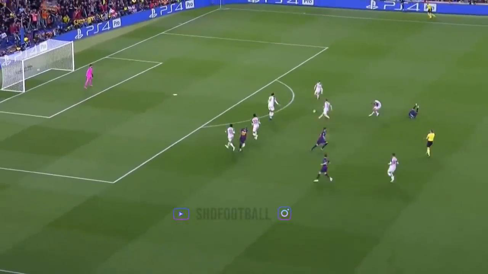

# lightgifs

Gifs and screenshot for humans :movie_camera:


## Installation

```shell
pip install -r requirements.txt
```

## Usage

download a sampe video with `youtube-dl`

```
youtube-dl https://www.youtube.com/watch\?v\=kdLkEmG05Ak
```

To generate a gif
```python
from lightgifs.lightgifs import Clip

Clip('Lionel Messi Amazing Freekick Goal vs Liverpool 2019-kdLkEmG05Ak.mkv')
.gif()
.save_gif()
```

This will generate


To generate a screenshot
```python
from lightgifs.lightgifs import Clip

Clip('Lionel Messi Amazing Freekick Goal vs Liverpool 2019-kdLkEmG05Ak.mkv')
.screenshot('00:00:02')
.save_screenshot()
```

This will generate




## Todo

- CLI

- Subclips

- Gif Settings control
